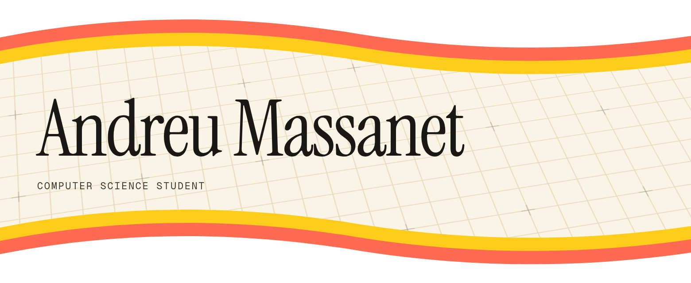

  

Computer Science student at the Universitat de les Illes Balears (Mallorca, Spain), specialising in Artificial Intelligence. My work runs from MC68000 assembly and C systems up to machine learning in Python and Java — I like building the machine under the model, not just calling one. Most recently I took a PropTech SaaS from beta to a paying product.

### Languages & Tools
---

  
  
  
  
  
  
  
  
  
  
  
  
  
  

